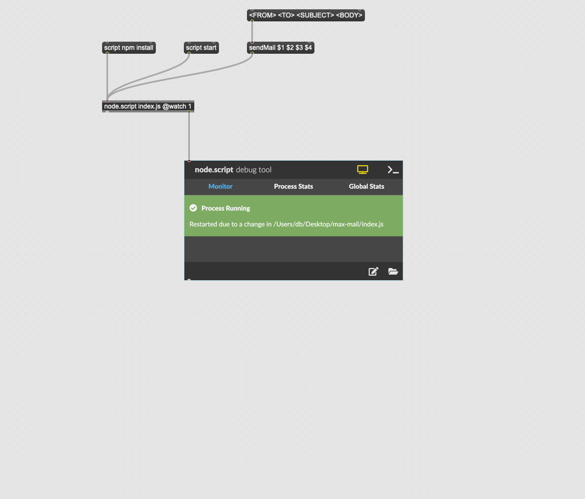

# MAX/MSP sending email via SMTP

Just a small patch using Nodejs and sending an email.



# Environment

Configure your SMTP settings in a `.env` file

```
SMTP_HOST=
SMTP_USER=
SMTP_PASSWORD=
SMTP_PORT=
```
